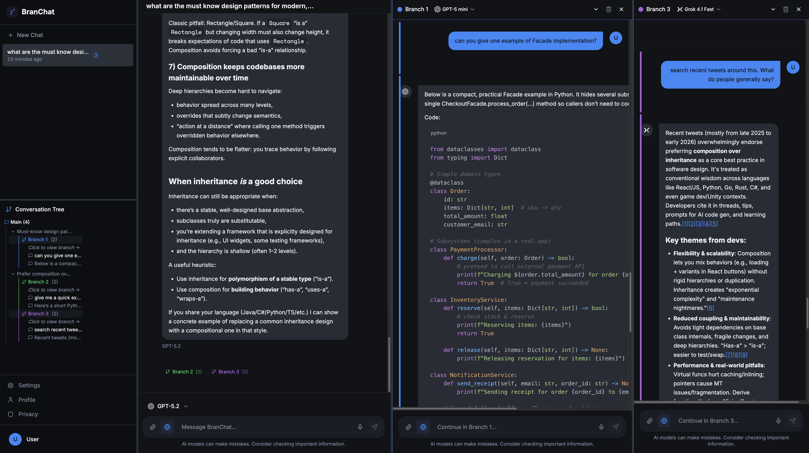

# BranChat

A powerful, privacy-focused AI chat application with non-linear conversation branching. Chat with multiple AI models simultaneously, explore different conversation paths, and maintain full control over your data.





## Features

- **🌳 Non-Linear Conversations** - Branch conversations at any point to explore different directions without polluting your main thread
- **🤖 Multi-Model Support** - Access best-of-breed models from OpenAI, Anthropic, Google, and xAI in one interface
- **🔄 Model Switching** - Switch models on the fly or use different models for different branches
- **🔒 Privacy First** - API-based usage means your data is never used to train models; all conversations stored locally only
- **📎 Rich Attachments** - Support for images and documents (PDF, Markdown, Plain Text)
- **🎨 Modern UI** - Beautiful, responsive interface with dark/light mode and intuitive branch visualization

## Why BranChat?

### Greater Privacy
Unlike consumer chat applications like ChatGPT, Claude.ai, or Gemini, BranChat uses API access which provides a fundamentally different privacy arrangement:

- **No training data**: API providers contractually commit to not using your API data to train their models. This is a key distinction from free consumer tiers where your conversations may be used for model improvement.
- **Your data, your control**: All conversations are stored locally on your device. No cloud sync, no data collection, no third-party servers.
- **Direct API access**: Your API keys connect directly to the provider's API. No intermediate services that could log or analyze your conversations.
- **Fully auditable code**: This project is fully open-source and the code is fully auditable. 

### Greater Options at Lower Cost
Instead of maintaining multiple $20/month subscriptions to different AI services, BranChat lets you:

- **Pay-as-you-go**: Use API pricing which is typically more cost-effective for moderate usage
- **Best model for each task**: Choose the optimal model for each conversation or branch without being locked into a single provider
- **No subscription lock-in**: Use exactly what you need, when you need it

### Non-Linear Conversations
Traditional chat apps force you into a linear conversation flow. BranChat's unique branching system allows you to:

- **Explore tangents**: Ask follow-up questions that don't pollute the main conversation thread
- **Better context utilization**: Branches maintain their own context, allowing you to explore different aspects of a topic without confusion
- **Parallel exploration**: Work on multiple conversation paths simultaneously
- **Clean main thread**: Keep your primary conversation focused while exploring alternatives in branches

### Second Opinions & Verification
Get more confidence in AI responses by:

- **Reusing conversations**: Start a new branch from any point in your conversation with a different model
- **Cross-verification**: Compare answers from different models on the same question
- **Model-specific strengths**: Use specialized models for different types of tasks (e.g., coding vs. creative writing)

### Open Source & Community-Driven
BranChat is built by the community, for the community:

- **Transparency**: Full source code available for inspection and audit
- **Customization**: Modify and extend the app to fit your needs
- **Community contributions**: Help shape the future of the project
- **No vendor lock-in**: You're not dependent on a proprietary service

## Demo (Video)

[](https://youtu.be/Ivju9mj6y8w)

## Installation

### Prerequisites
- Node.js 18+ and npm (or pnpm/yarn)
- API keys from one or more providers:
  - [OpenAI API Key](https://platform.openai.com/api-keys)
  - [Anthropic API Key](https://console.anthropic.com/)
  - [Google AI API Key](https://makersuite.google.com/app/apikey)
  - [xAI API Key](https://x.ai/api)

### Local Development and Usage (Web)

1. Clone the repository:
```bash
git clone https://github.com/yourusername/branch-chat.git
cd branch-chat
```

2. Install dependencies:
```bash
npm install
```

3. Start the development server:
```bash
npm run dev
```

4. Open [http://localhost:5173](http://localhost:5173) in your browser

5. Go to **Settings** and add your API keys. Keys are stored securely in your browser's local storage.

### Building for Production

```bash
# Build web version
npm run build

# Preview production build
npm run preview
```

### Mac App (Electron)

1. Build the Electron app:
```bash
npm run build:electron
```

2. Build the Mac installer:
```bash
npm run build:mac
```

The installer will be created in the `dist` directory.

3. After installing, go to **Settings** and add your API keys. Keys are stored securely in your macOS Keychain.

## Usage

### Getting Started

1. **Add API Keys**: Go to Settings and add your API keys for the providers you want to use. Keys are stored securely in your macOS Keychain (desktop app) or browser local storage (web).

2. **Start a Conversation**: Click "New Conversation" and select a model to begin chatting.

3. **Create a Branch**: Hover over any message and click the branch icon to create a new conversation branch from that point.

4. **Switch Models**: Change the model for the main conversation or any branch using the model selector.

5. **Manage Branches**: 
   - Open/close branch panels from the sidebar
   - Collapse branches to save space
   - Each branch maintains its own context and model

### Tips

- **Branch strategically**: Create branches when you want to explore alternatives without losing your main thread
- **Use different models**: Try different models in branches to get diverse perspectives
- **Reuse context**: Start a branch from an earlier message to reuse that context with a different model
- **Organize conversations**: Use the conversation list to manage multiple topics

## Development

### Project Structure

```
src/
├── components/        # React components
│   ├── chat/         # Chat-specific components
│   ├── layout/       # Layout components
│   └── ui/           # shadcn/ui components
├── contexts/         # React contexts (state management)
├── services/         # API and database services
├── types/            # TypeScript type definitions
└── pages/            # Page components
```

### Key Technologies

- **React 18** - UI framework
- **TypeScript** - Type safety
- **Vite** - Build tool and dev server
- **Tailwind CSS** - Styling
- **shadcn/ui** - UI component library
- **React Query** - Data fetching and caching
- **sql.js** - SQLite in WebAssembly for local storage
- **Electron** - Desktop app framework

### Scripts

```bash
npm run dev              # Start development server
npm run dev:electron     # Start Electron dev mode
npm run build            # Build for production
npm run build:electron   # Build Electron app
npm run build:mac        # Build Mac installer
npm run lint             # Run ESLint
npm run preview          # Preview production build
```

## Contributing

We welcome contributions! Here's how you can help:

1. **Report bugs**: Open an issue describing the problem
2. **Suggest features**: Share your ideas for improvements
3. **Submit PRs**: Fork the repo, make your changes, and submit a pull request
4. **Improve documentation**: Help make the README and code comments better

### Development Guidelines

- Follow the existing code style
- Write meaningful commit messages
- Add tests for new features when possible
- Update documentation for user-facing changes

## Roadmap

- [X] Web search
- [ ] Voice input support
- [ ] Implement smart chat titling (title by LLM)
- [ ] Deep Research (for APIs that support it)
- [ ] Export/import conversations (Markdown, JSON)
- [ ] Add Conversation search
- [ ] Add SOTA open models (DeepSeek, Qwen, Z.ai)
- [ ] Add image generation/edit models (NanoBanana, GPT Image 1.5)
- [ ] Custom model configurations
- [ ] Implement artifacts
- [ ] Implement memory
- [ ] Implement projects
- [ ] Implement GPTs/Gems equivalent
- [ ] Implement 'summarize this conversation'
- [ ] Basic integration set: Drive, Gmail, Calendar
- [ ] MCP support
- [ ] Add token analytics and chat cost estimation
- [ ] Windows and Linux Electron builds


## License

This project is licensed under a Non-Commercial License. See [LICENSE](LICENSE) for details.

**Summary**: You are free to use, modify, and distribute this software for personal and non-commercial purposes. Commercial use is not permitted without explicit permission.

## Privacy & Security

- **API Keys**: Stored securely in your macOS Keychain (desktop app) or browser local storage (web). Never transmitted anywhere except directly to the AI provider APIs.
- **Data Storage**: All conversations are stored locally using SQLite in your browser or app data directory.
- **No Telemetry**: BranChat does not collect any usage data or analytics.
- **No Network Calls**: The only external connections are direct API calls to the AI providers you configure.

### Security Notice

This application is designed to run locally on your own computer. API keys are stored locally and sent directly from your browser to the AI providers.

**Do not host this application publicly** - doing so would expose your API keys to anyone who accesses the hosted version. If you need a multi-user hosted solution, you must implement a backend proxy server to securely manage API keys.

## Support

- **Issues**: [GitHub Issues](https://github.com/yourusername/branch-chat/issues)
- **Discussions**: [GitHub Discussions](https://github.com/yourusername/branch-chat/discussions)

## Acknowledgments

- Built with [shadcn/ui](https://ui.shadcn.com/)
- Icons from [Lucide](https://lucide.dev/)
- Powered by OpenAI, Anthropic, Google AI, and xAI APIs

---

**Made with ❤️ by the open source community**
